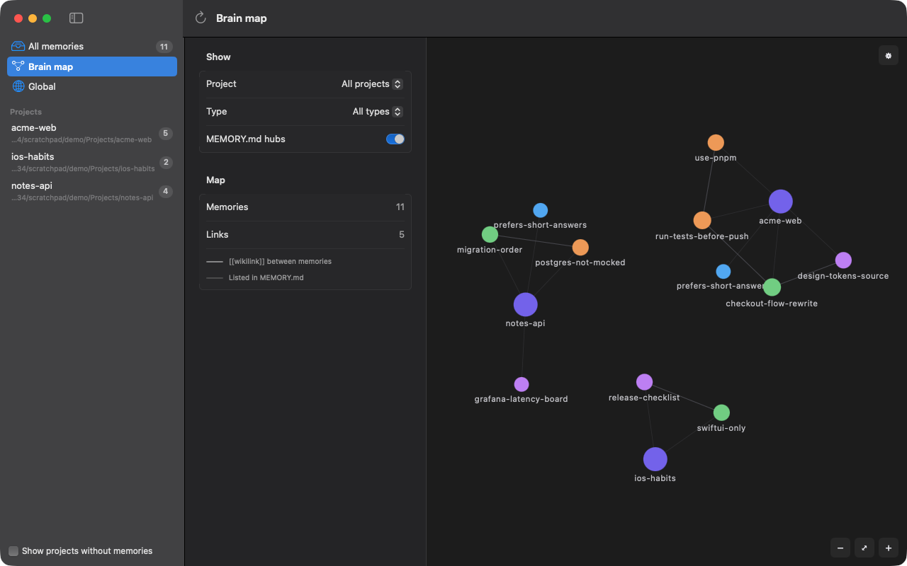
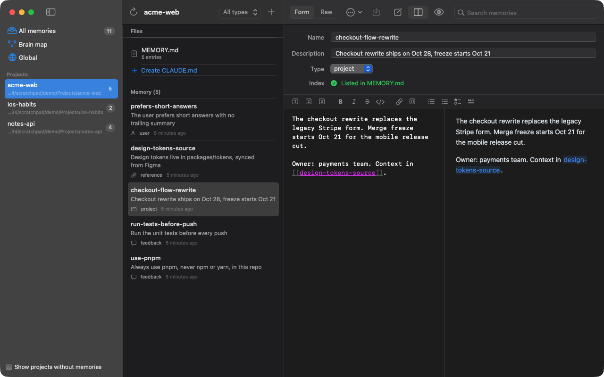
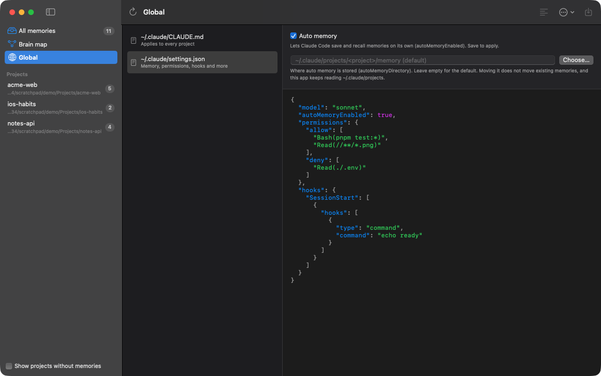

# Claude Memory

A native macOS app to browse and edit the memory files [Claude Code](https://claude.com/claude-code) keeps in `~/.claude`.

## Features

- Browse memories across every project, or one project at a time
- Edit memory files with a structured form (title, description, type, body)
- Edit `MEMORY.md` index files and `CLAUDE.md` instructions (project and global) with a markdown editor and live preview
- Edit `~/.claude/settings.json` with a syntax-highlighted JSON editor (validation and a **Format** button that keeps key order), an **Auto memory** switch (`autoMemoryEnabled`) and a memory folder field (`autoMemoryDirectory`); each changes only its own value and keeps the rest of the file as written
- Warns when `MEMORY.md` is longer than the 200 lines / 25 KB Claude Code loads
- Create, delete (to Trash) and add memories to the project index
- Live reload: a file watcher on `~/.claude` plus a **Reload** button (⌘R)
- Safe saving: warns when a file changed on disk instead of overwriting it, and asks before quitting with unsaved changes

## Screenshots

Captured on sample data, not a real `~/.claude`.

**Brain map** — memories as an Obsidian-style graph, linked by `[[wikilinks]]` and `MEMORY.md` entries



**Memory editor** — structured form, markdown editor with live preview, and `[[wikilinks]]`



**settings.json** — JSON editor with the Auto memory switch and memory folder picker



## Requirements

- macOS 14 or later
- Swift 6 toolchain (Xcode 16 or the Swift command line tools)

## Build and run

```sh
git clone https://github.com/bonnguyenitc/claude-memory-app.git
cd claude-memory-app
Scripts/compile_and_run.sh
```

This builds the package, assembles `ClaudeMemory.app` and launches it.

Other options:

```sh
Scripts/compile_and_run.sh --test               # run the tests first
Scripts/compile_and_run.sh --release-universal  # universal (arm64 + x86_64) release build
swift test                                      # tests only
```

## Running on another folder

The app reads `~/.claude` by default. Set `CLAUDE_HOME` to point it at a different folder, for example a copy with sample data:

```sh
CLAUDE_HOME=/path/to/sample-claude-home ClaudeMemory.app/Contents/MacOS/ClaudeMemory
```

## Project layout

| Path | Purpose |
| --- | --- |
| `Sources/MemoryCore` | Models, file repository, project path resolution, markdown parsing and formatting |
| `Sources/ClaudeMemory` | SwiftUI app: sidebar, memory list, editors, preview |
| `Tests/MemoryCoreTests` | Unit tests for the core library |
| `Scripts` | Packaging and run scripts |

## License

[MIT](LICENSE)
